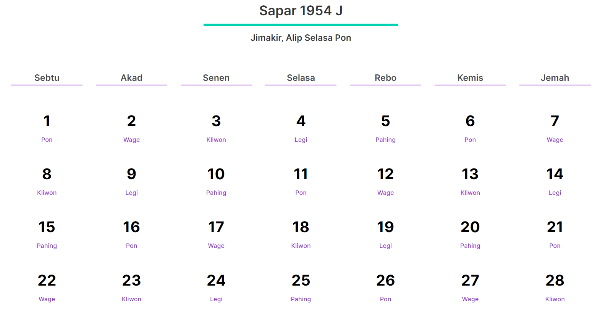

# Sengkala

Prototipe UI untuk aplikasi web kalender jawa.

## Stack

- Vue.js
- Nuxt.js

## Pengembangan

Untuk pengembangan lokal jalankan `npm`

`npm install`

`npm run dev`

kemudian akses aplikasi pada browser

`http://localhost:3000`

----

KalenderJawa.dev © 2020 M (1953J - 1954 J)
